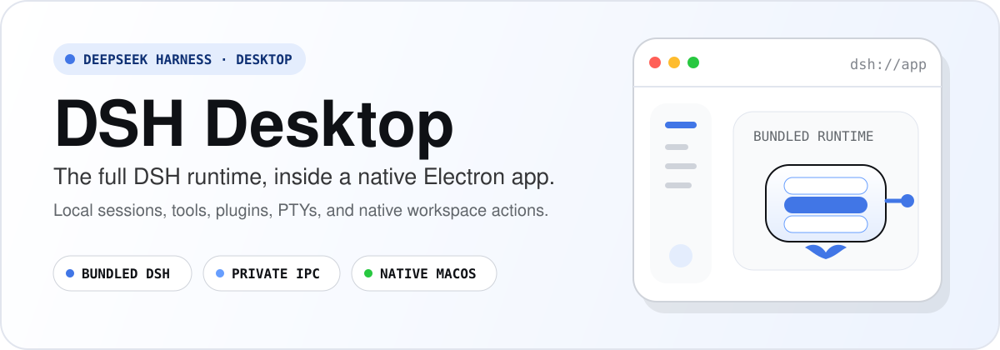
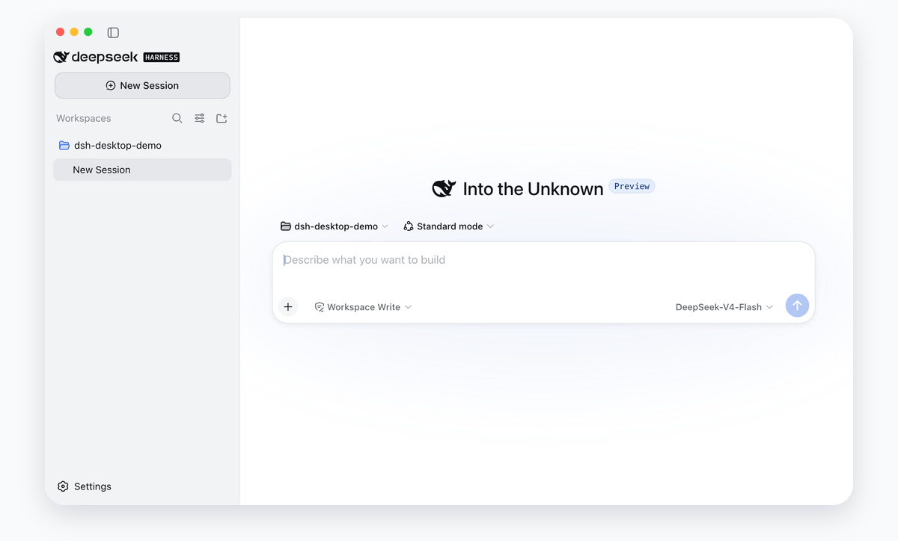
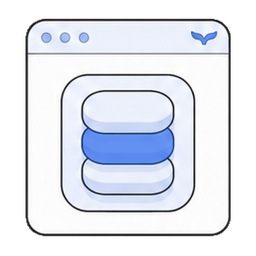
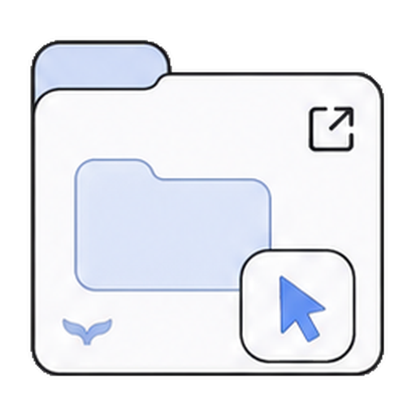
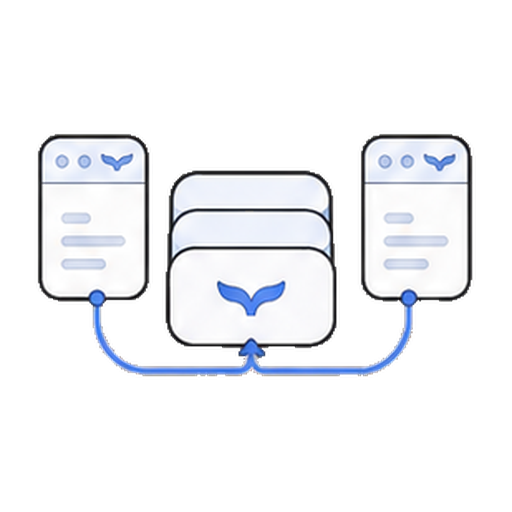
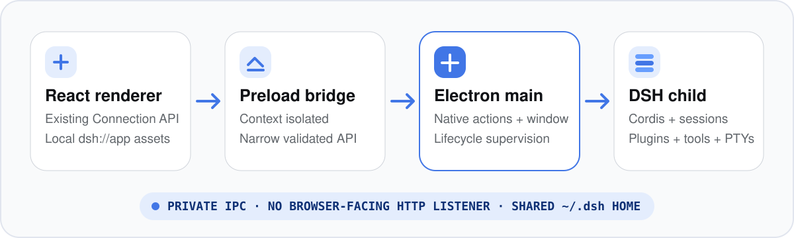

# DSH Desktop

[English](README.md) | 中文

<p align="center">
  
</p>

`deepseek-harness-desktop` 将 [DeepSeek Harness](https://github.com/deepseek-ai/deepseek-harness) 打包为原生 Electron 应用 **DSH Desktop**。桌面外壳是本项目专属的产品层；内置 `dsh` 运行时继续保留插件系统、Session、工具、PTY、持久化、CLI 身份与文档术语。

<p align="center">
  
</p>

<p align="center"><sub>来自已安装 macOS 应用包的 renderer 捕获，以中性背景呈现紧凑窗口框架与默认玻璃侧栏布局。</sub></p>

## 桌面外壳，完整 harness

<table>
  <tbody>
    <tr>
      <td align="center" width="50%"><br><strong>内置运行时</strong><br>安装后的应用会启动自己的应用级 DSH 子进程，不要求系统提供 Node.js，也不要求另行安装 DSH CLI。</td>
      <td align="center" width="50%"><br><strong>私有桌面载体</strong><br>沙箱化 renderer 通过上下文隔离的 preload 桥和经过校验的 IPC 访问 DSH；desktop profile 不会打开面向浏览器的 HTTP 监听。</td>
    </tr>
    <tr>
      <td align="center" width="50%"><br><strong>原生 macOS 外壳</strong><br>Electron main 持有目录选择、路径打开、紧凑窗口框架与原生拖动、恢复和进程树清理；侧栏使用已保存的玻璃侧栏偏好。</td>
      <td align="center" width="50%"><br><strong>共享 DSH 状态</strong><br>DSH Desktop 与 CLI 使用同一个 <code>~/.dsh</code> 主目录，因此两者都能访问 Session、profile 与配置。</td>
    </tr>
  </tbody>
</table>

## 工作原理

React 客户端继续使用与 Web 产品相同、与传输无关的 Connection 接口。Electron main 持有原生窗口并监管一个专用 DSH 子进程；该子进程持有 Cordis、Session、插件、模型执行、PTY、持久化与子进程。

<p align="center">
  
</p>

完整的载体、生命周期、打包、原生操作、恢复与安装态验收约定由[桌面应用参考](apps/desktop/README.md)维护。

<a id="run"></a><a id="run-from-source"></a>

## 从源码启动

本项目处于开发者预览阶段。在当前仓库 checkout 中运行：

```sh
pnpm install
pnpm run build
pnpm run dev:desktop
```

### 构建 macOS 产物

```sh
pnpm --filter @deepseek-ai/dsh-desktop run package
```

打包命令会在 `apps/desktop/dist/` 下生成当前主机架构的 `.app` 与 `.dmg`。目前的本地产物使用 ad-hoc 签名且未经公证，因此下载后的构建可能需要在 macOS 上执行一次右键 → 打开。

## 项目边界

- [DSH Desktop 应用参考](apps/desktop/README.md) — Electron 架构、安全、生命周期、打包、验收与限制。
- [DeepSeek Harness 架构](docs/architecture.md) — 内置插件运行时及其扩展模型。
- [DeepSeek Harness 用户文档](docs/user/index.md) — DSH 内核概念与受支持工作流。
- [上游 README 归档：English](archive/deepseek-harness-readme.md) · [中文](archive/deepseek-harness-readme.zh.md) — 桌面版首页替换根入口时保留的原项目概览与上手资料。
- [上游仓库](https://github.com/deepseek-ai/deepseek-harness) — 本桌面仓库直接基于的原始 DeepSeek Harness 项目。

## 状态与分发

- 仓库与应用仍在积极开发中，未来仍可能出现破坏兼容性的变更。
- 当前检入的打包路径面向 macOS，并构建主机架构产物。
- 尚未配置 Developer ID 签名与公证；分发产物前请阅读[桌面端限制](apps/desktop/README.md#limitations)。

## 开发

内核贡献流程继续以 [CONTRIBUTING.md](CONTRIBUTING.md)、[开发指南](docs/development.md)和 [AGENTS.md](AGENTS.md) 为准。修改内置 harness 时仍应遵守这些源自上游的约定；桌面端专属实现位于 [`apps/desktop`](apps/desktop) 及其配套桌面插件中。

## 许可证

[MIT](LICENSE)

第三方依赖及其许可证见 [THIRD_PARTY_NOTICES.md](THIRD_PARTY_NOTICES.md)。
